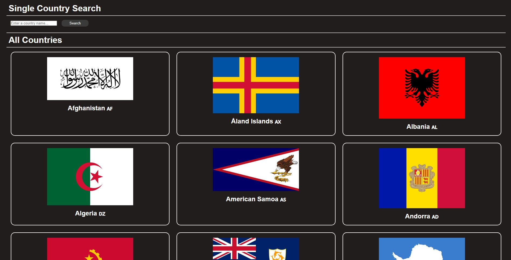
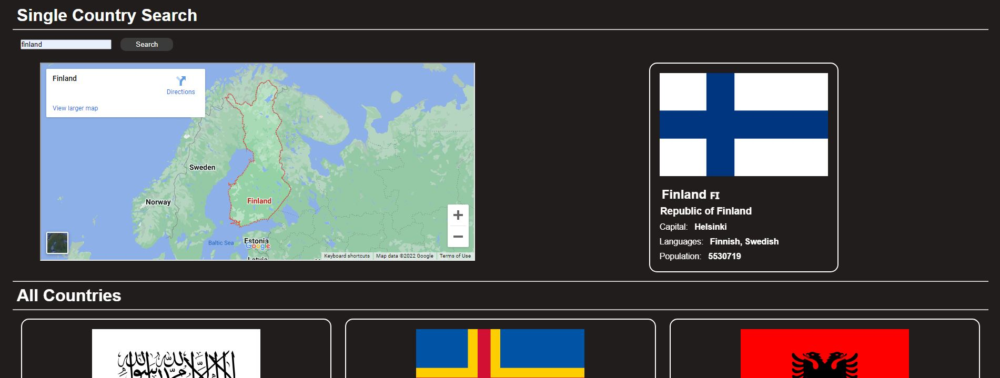

# JavaScript Assignment


This repo has few javascript questions that I have attempted, as well as a webpage designed to display search results from an API.

Check out my website here: https://adelansari.github.io/Fullstack13-JavaScript/

## Table of content
  - [Technologies](#technologies)
  - [Project structure](#project-structure)
  - [Getting Started](#getting-started)
  - [Result](#result)
  - [Resources](#resources)

## Technologies

- HTML5
- CSS
- JS

## Project structure

```
📦.
 ┣ 📜countriesJavascriptAPI.JPG
 ┣ 📜countyJavascriptAPI.JPG
 ┣ 📜index.html
 ┣ 📜index.js
 ┣ 📜README.md
 ┗ 📜style.css
```

## Getting Started

- Clone the repository: `git clone`
- Open index.html with "Live Server".

## Result

• Default view:
<p align="center"></p>

• Result from seaching a country name:
<p align="center"></p>